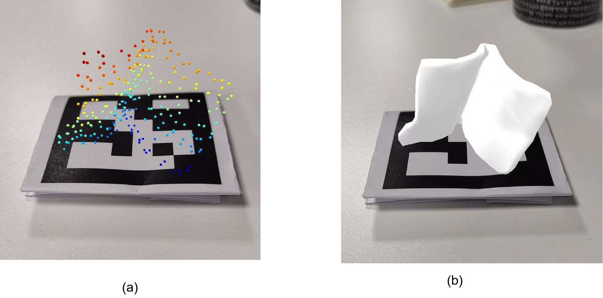

# paper-materials
The image below shows the application of mesh in AR. The (a) image is a point cloud, which doesn't have a surface and cannot be easily recognized by the human eye. The (b) image is a mesh model, which is more visually accessible for users and makes it easier to recognize the object being represented.

From the file sample2.gif, it can be seen more specifically that it is difficult for users to directly judge the object through point clouds, and the interactive experience feels poor.
